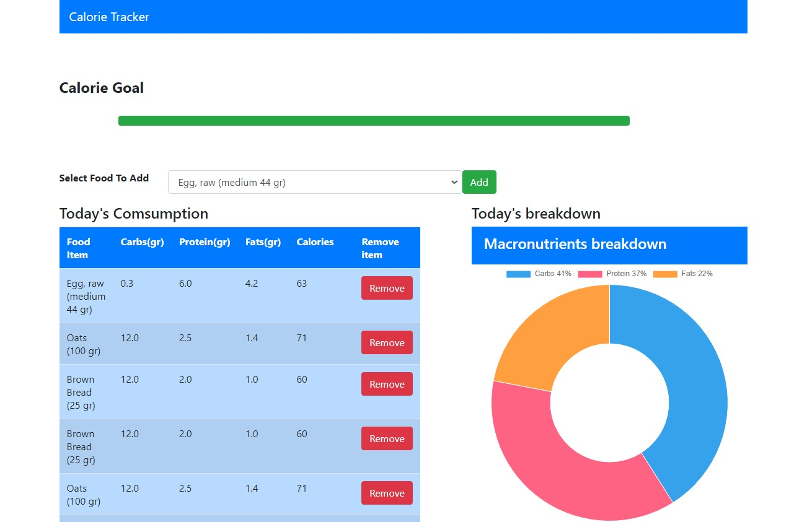

# Django Calorie Tracker

This is a comprehensive Calorie Tracker application built with Django. It allows users to monitor their daily food consumption and nutritional intake.

## Features
- **Food Selection**: Users can add various food items to their daily consumption list.
- **Nutritional Breakdown**: The application provides a detailed breakdown of macronutrients (Carbs, Protein, Fats) for each food item.
- **Calorie Goal Tracking**: Users can set a daily Calorie Goal and track their progress towards it.
- **Visual Insights**: The application provides visual insights through pie charts for an easy understanding of the nutritional composition.
- **Easy Management**: Each food item in the consumption list can be easily managed with a "Remove" button.

This application aims to help users make informed decisions about their diet and lead a healthier lifestyle.

