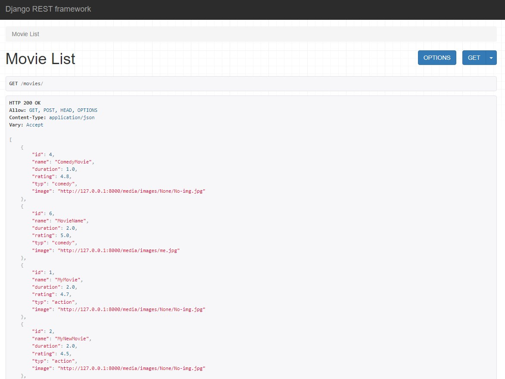
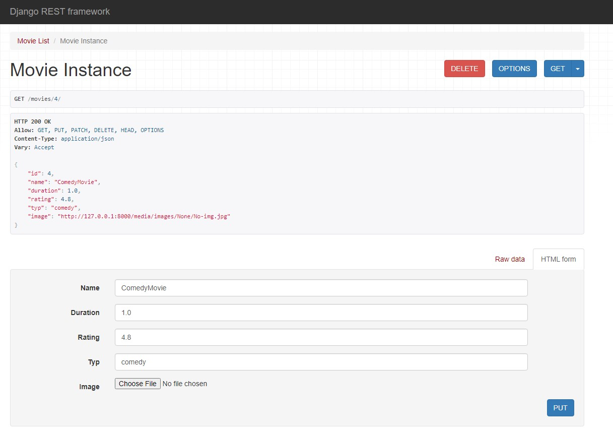

# Django Movie List

This is a dynamic and interactive movie list application built with Django and Django REST framework.

## Features
- **Movie Retrieval**: Users can easily retrieve detailed information about various movies.
- **Detailed Information**: Each movie's details such as genres, duration, ratings, and images are available.
- **RESTful API**: The application utilizes Django REST framework to handle GET requests for retrieving movies.
- **Clean and User-Friendly Interface**: The project is designed with a clean and user-friendly interface ensuring seamless navigation and interaction.

This application aims to provide users with an easy and efficient way to explore and retrieve information about their favorite movies.

