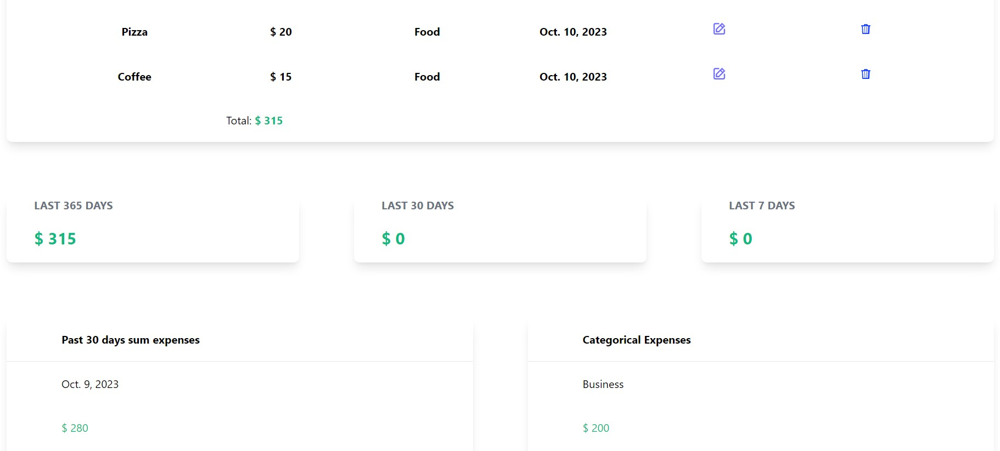

# Expense Tracker Django Application

This Django project is an Expense Tracker application that allows users to manage and track their expenses. The application provides the following features:

## Features

### Add Expenses
Users can add new expenses by entering the expense name, amount, and category.

### Expense List
The application displays a list of all expenses with details such as name, amount, category, date, and options to edit or delete each expense.

### Total Expenses
The application calculates and displays the total expenses incurred in the last 365 days, 30 days, and 7 days.

### Past 30 Days Expenses
A separate section displays the sum of expenses for each day in the past 30 days.

### Categorical Expenses
The application provides a breakdown of expenses by category, displaying the total amount spent in each category.

### Expense Visualization
The application includes visual representations of expense data, such as:
- A pie chart showing the distribution of expenses across categories
- A line chart displaying the sum of daily expenses over time

The Expense Tracker application aims to help users maintain a comprehensive record of their expenses, analyze spending patterns, and make informed financial decisions based on the provided insights.

