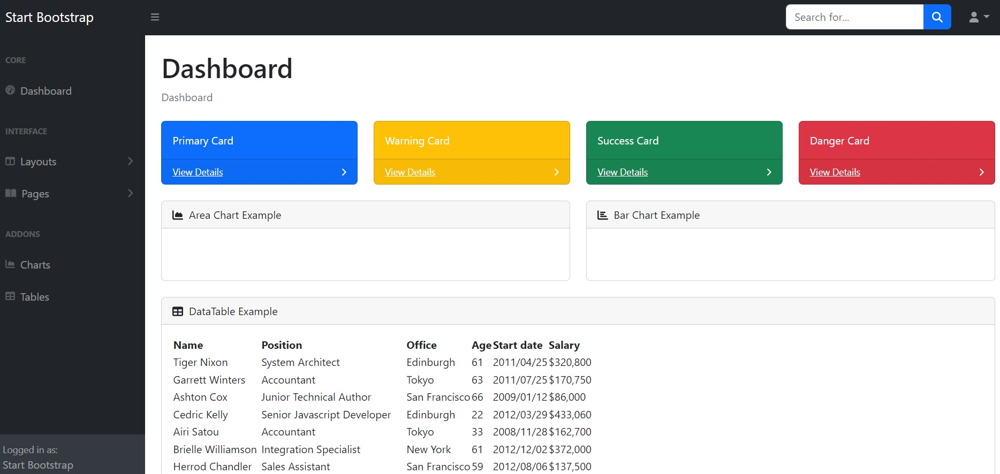

# Django App with Bootstrap Theme

This is a Django web application that utilizes the Bootstrap framework for styling and UI components.

## Features

- Responsive design with Bootstrap
- Custom dashboard with various card components
- Area chart and bar chart examples
- Data table example with sortable columns

