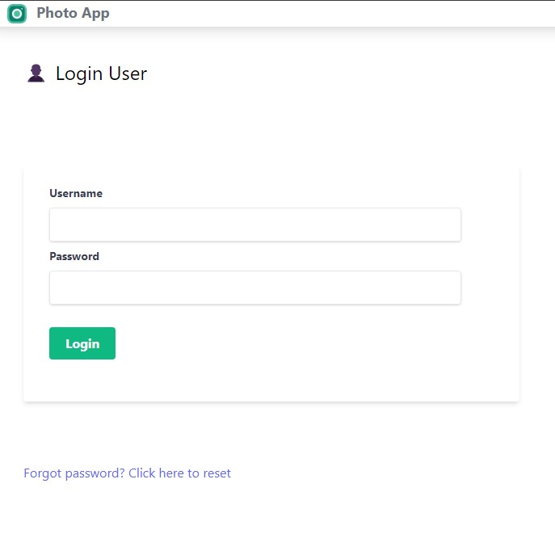
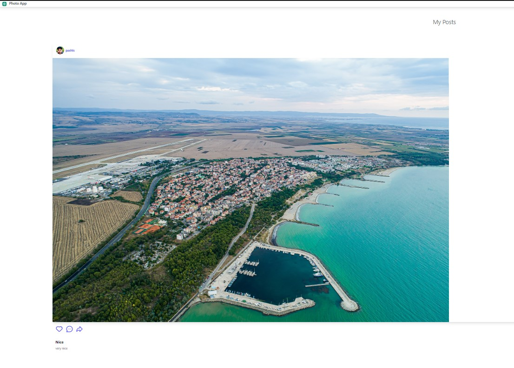

# Social Photo App

This is a Django web application that allows users to share and interact with photos. Users can create accounts, upload photos, like and comment on photos posted by others, and follow other users.

## Features

- User authentication (registration, login, logout)

  
- Create, view, update, and delete photos

  
- Like and comment on photos
- Follow other users
- User profiles with uploaded photos
- Explore page for browsing photos from all users

## Prerequisites

- Python 3.x
- Django
- Pillow (Python Imaging Library)

## Usage

1. Create a new account or log in with an existing one.
2. Upload photos by going to your profile page.
3. Browse photos from all users on the explore page.
4. Like and comment on photos.
5. Follow other users to see their photos on your feed.

